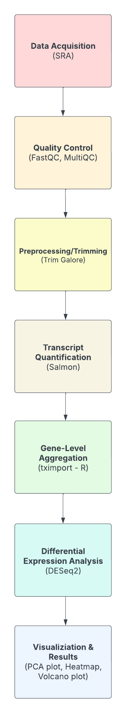
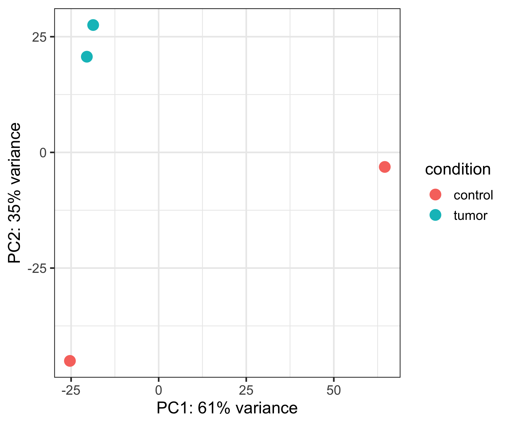
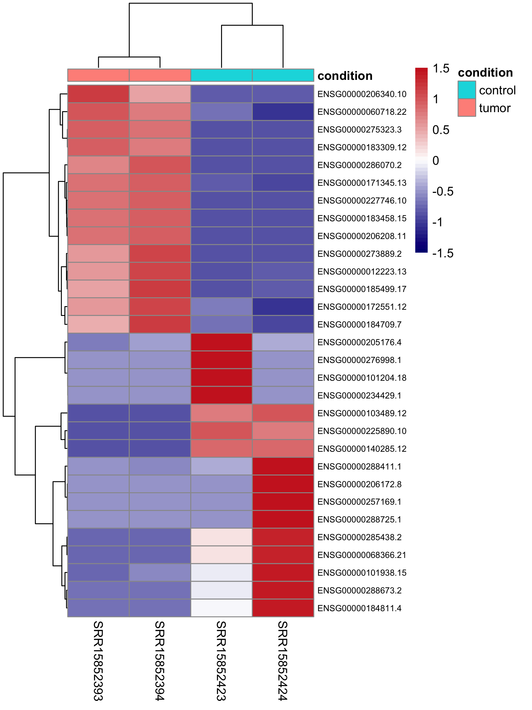
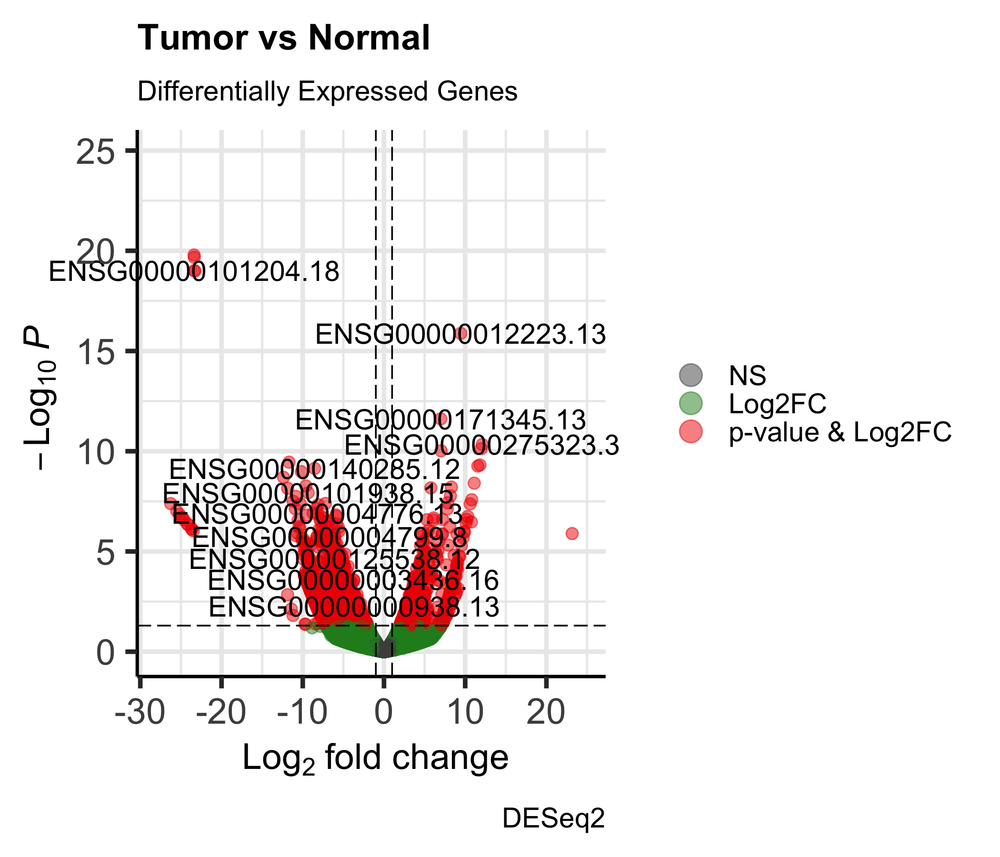

# RNA-seq Differential Expression

This project demonstrates a complete RNA-seq analysis pipeline from raw sequencing reads to differential expression results, using public data for **GSE183947**. It showcases core bioinformatics skills: reproducible pipelines, QC, read quantification, and statistical analysis.

**Note:** For this project, the number of replicates for both normal and tumor samples was reduced to **2 each** to simplify analysis. The workflow is fully scalable to include more replicates.

---

## 📂 Project Structure

rnaseq_GSE183947/
- **metadata/**              
  - SRR_Acc_List.txt
  - SraRunTable.csv
  - samplesheet.txt
- **scripts/**               
  - deseq2.r
  - download_fastqs.sh
  - fastqc.sh
  - fastqc_trimmed.sh
  - salmon.sh
  - trim.sh
  - tximport.r
- **results/**
  - **deseq2/**
    - DESeq2_results.csv
    - PCA_plot.png
    - Heatmap_top30.png
    - Volcano_plot.png
- requirements.txt            
- rnaseq_analysis.ipynb       
- README.md                   


---

## Workflow Overview



---

## Visualization

**PCA plot (sample clustering)**  


**Heatmap (top 30 DE genes)**  


**Volcano plot (significant DE genes)**  


---

## Results

- PCA plot shows clear separation between tumor and normal samples.  
- Heatmap of the top 30 differentially expressed genes highlights expression patterns.  
- Volcano plot highlights significantly up- and down-regulated genes.  

Full differential expression results are in:  
📄 `results/deseq2/DESeq2_results.csv`

---

##  Reproducibility

### Dependencies

See `requirements.txt` for a full list. Key tools used:

- `fastqc`, `multiqc`, `trim-galore`  
- `salmon (v1.10.3)`  
- R (>=4.2.0) with **DESeq2**, **tximport**, **ggplot2**, **pheatmap**

### Running the pipeline

```bash
###  Running the Pipeline

Clone the repository and run the analysis in the following order:

```bash
# Clone the repo
git clone https://github.com/vngosb/rnaseq_GSE183947.git
cd rnaseq_GSE183947 

# Download raw FASTQ files (not included here)
bash scripts/download_fastqs.sh

# Initial quality control
bash scripts/fastqc.sh

# Trim reads
bash scripts/trim.sh

# Quality control after trimming
bash scripts/fastqc_trimmed.sh

# Quantify reads with Salmon
bash scripts/salmon.sh

# Import transcript-level quantification into R
Rscript scripts/tximport.r

# Run differential expression analysis with DESeq2
Rscript scripts/deseq2.r
